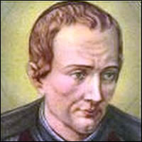
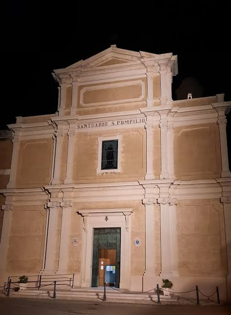

# San Pompilio María Pirrotti

Sacerdote escolapio (1710 - 1766)

Proyecto web: Rostros de la Santidad Escolapia

- [Presentación](#presentacion)
- [Biografía](#biografia)
- [Obra](#obra)
- [Testimonio](#testimonio)
- [Legado](#legado)
- [Cronología](#cronologia)
- [Lugares](#lugares)
- [Trivia](#trivia)
- [Fuentes](#fuentes)

## ¿Quién fue San Pompilio?

Retrato de San Pompilio María Pirrotti

San Pompilio María Pirrotti fue un sacerdote escolapio italiano que vivió en el siglo XVIII. Nació en Montecalvo Irpino y murió en Campi Salentina. Se dedicó a enseñar, a predicar y a ayudar a los más pobres, siguiendo el carisma de San José de Calasanz.

Por su trabajo con los jóvenes en el centro de Italia se lo conoce como el "Apóstol de los Abruzos". Fue declarado santo en 1934.

Nota: su apellido se escribe Pirrotti (con doble r) en la mayoría de las fuentes, pero en algunos textos aparece como Pirotti.

### Datos principales

Nombre de nacimiento

Domenico Michele Giovan Battista Pirrotti

Nacimiento

29 de septiembre de 1710, Montecalvo Irpino (Reino de Nápoles)

Fallecimiento

15 de julio de 1766, Campi Salentina

Orden

Clérigos Regulares de las Escuelas Pías (escolapios)

Beatificación

26 de enero de 1890, por el papa León XIII

Canonización

19 de marzo de 1934, por el papa Pío XI

Fiesta

15 de julio

## Biografía

### Infancia y familia

Domenico nació el 29 de septiembre de 1710 en Montecalvo Irpino. Fue el sexto de once hermanos. Su papá, Girolamo, era doctor en leyes y su mamá se llamaba Orsola Bozzuti.

### Su vocación

A los 16 años sintió el llamado a la vida religiosa. Sus padres no estaban de acuerdo y él se fue de su casa para seguir ese camino. Con el tiempo su papá le escribió una carta para pedirle perdón y darle su bendición.

Tomó el hábito en Nápoles el 2 de febrero de 1727 y el 25 de marzo de 1728 hizo su profesión solemne en Brindisi. Ahí pasó a llamarse Pompilio María de San Nicolás. El nombre Pompilio era el de un hermano suyo que había muerto. Además de los votos religiosos, como escolapio se comprometió a educar a los jóvenes pobres.

### Estudios y primeros destinos

Lo mandaron a Chieti a estudiar filosofía, pero se enfermó y lo trasladaron a Melfi, donde siguió estudiando. En 1733 llegó a Turi y empezó a dar clases de literatura. Más adelante estuvo en Brindisi (de 1736 a 1739) y en Ortona (de 1739 a 1742).

### Críticas y destierro

Desde 1747 algunas personas lo criticaron porque decían que era demasiado permisivo con los pecadores que se confesaban con él. El arzobispo de Nápoles, el cardenal Antonio Sersale, le prohibió confesar por un tiempo.

Después el rey Carlos III firmó un decreto para echarlo del Reino de Nápoles. Pero mucha gente lo defendía y lo quería, sobre todo los más necesitados, y el rey terminó cancelando la orden. Pompilio volvió a la ciudad.

### Últimos años y muerte

En 1765, durante una hambruna cerca de su pueblo natal, repartió pan entre los que más sufrían. En julio de 1766 estaba en Lecce, celebró misa el día 13 y se puso a confesar, pero se enfermó de golpe. Murió el 15 de julio de 1766 en Campi Salentina, a los 55 años.

## Obra

### Educador escolapio

Siguiendo el carisma de los hijos de San José de Calasanz, trabajó en las Escuelas Pías de varias regiones de Italia. Empezó dando clases de literatura en Turi y se dedicó mucho a los jóvenes.

### Predicador y confesor

Fue un predicador incansable. Además, mucha gente se acercaba a confesarse con él.

### Caridad con los pobres

En la hambruna de 1765 repartió pan. También fundó una cofradía llamada "Caridad de Dios", que buscaba difundir las virtudes cristianas y acompañar a los moribundos.

### Sus devociones

- La Virgen María, a quien llamaba "Mamma Bella"
- El Sagrado Corazón de Jesús
- El Santísimo Sacramento
- El Vía Crucis, que ayudó a difundir
- San José de Calasanz, fundador de las Escuelas Pías

## Testimonio

Se le atribuye una frase que resume cómo vivía su fe:

> "Dios, Dios, Dios y nada más."

(La frase aparece en italiano y en alemán en las fuentes, la traducción al español es nuestra.)

Aguantó críticas, una suspensión y hasta un destierro, y aun así la gente, sobre todo los más pobres, lo siguió queriendo y defendiendo.

Hay quienes cuentan que tenía el don de curar y de profetizar. Eso forma parte de lo que se dice de él en la tradición escolapia y no son datos documentados, por eso lo aclaramos acá aparte.

## Legado

### El camino a la santidad

- Siglo XIX: se abrió su causa en Lecce y fue declarado Siervo de Dios
- 17 de noviembre de 1878: fue declarado Venerable
- 26 de enero de 1890: el papa León XIII lo beatificó
- 19 de marzo de 1934: el papa Pío XI lo canonizó en la Basílica de San Pedro

Para la beatificación y para la canonización la Iglesia reconoció milagros atribuidos a su intercesión (dos para cada una).

### Su recuerdo hoy

- Su fiesta se celebra el 15 de julio.
- Es patrono de Montecalvo Irpino y de Campi Salentina.
- En Montecalvo Irpino hay una iglesia dedicada a él.
- En 1966 sus restos fueron trasladados al santuario que lleva su nombre.
- En 2006 un parque de Campi Salentina recibió su nombre.
- En 2010 se hizo un "Año Pompiliano" por los 300 años de su nacimiento.
- En 2011 el papa Benedicto XVI saludó en una audiencia a los fieles de Montecalvo Irpino que se juntaron en su recuerdo y lo nombró como su patrono.

Santuario San Pompilio Maria Pirrotti

## Cronología

1. **1710:** nace en Montecalvo Irpino.
2. **1727:** toma el hábito en Nápoles.
3. **1728:** profesión solemne en Brindisi y cambia su nombre.
4. **1733:** llega a Turi y empieza a enseñar literatura.
5. **1736 - 1739:** está en Brindisi.
6. **1739 - 1742:** está en Ortona.
7. **1747:** empiezan las críticas contra él.
8. **1765:** reparte pan durante la hambruna.
9. **1766:** muere en Campi Salentina.
10. **1878:** es declarado Venerable.
11. **1890:** es beatificado.
12. **1934:** es canonizado.
13. **1966:** sus restos se trasladan al santuario.
14. **2010:** Año Pompiliano.

## Lugares importantes

Lugares donde vivió y trabajó

| Lugar | Qué pasó ahí |
| --- | --- |
| Montecalvo Irpino | Nació en 1710. Hoy es su patrono. |
| Nápoles | Tomó el hábito escolapio en 1727. |
| Brindisi | Hizo su profesión solemne en 1728 y estuvo de 1736 a 1739. |
| Chieti | Lo mandaron a estudiar filosofía y se enfermó. |
| Melfi | Siguió sus estudios. |
| Turi | En 1733 empezó a dar clases de literatura. |
| Ortona | Estuvo de 1739 a 1742. |
| Campi Salentina | Murió en 1766. Hay un parque con su nombre. |

## Trivia: ¿cuánto sabés de San Pompilio?

Respondé las preguntas y fijate cuántas acertaste.

1\. ¿En qué año nació? 1690\
1710\
1766

2\. ¿Cómo llamaba a la Virgen María? Madre Santa\
Mamma Bella\
Reina del Cielo

3\. ¿En qué año fue declarado santo? 1890\
1934\
1966

## Fuentes

Algunas de las fuentes están en italiano, inglés o alemán.

- Dicastero delle Cause dei Santi (Vaticano): [Pompilio Maria Pirrotti](https://www.causesanti.va/it/santi-e-beati/pompilio-maria-pirrotti.html)
- Wikipedia (en inglés): [Pompilio Maria Pirrotti](https://en.wikipedia.org/wiki/Pompilio_Maria_Pirrotti)
- Piaristen Österreich (escolapios de Austria): [Heiliger Pompilius Maria Pirotti](https://www.piaristen.at/nachtrag-heiliger-pompilius-maria-pirotti/)
- Piaristen Österreich (escolapios de Austria): [Pompilio Maria Pirrotti](https://piaristen.at/?p=2312)

Trabajo realizado por Francisco Chierico y Valentino Rodríguez 3C

Taller de Informática Profe Marynellis Zambrano 